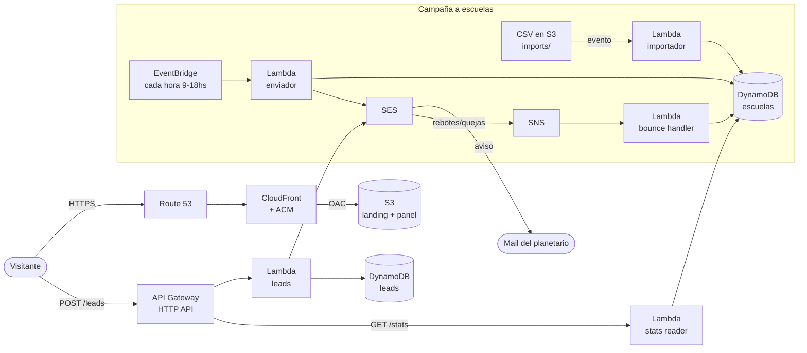

# 🔭 Planetario Móvil — Infraestructura AWS con Terraform

Infraestructura **100% como código** para [planetariomendoza.com.ar](https://planetariomendoza.com.ar): la landing page de un planetario móvil que visita escuelas de Mendoza, más un backend serverless para recibir pedidos de presupuesto y hacer campañas de contacto por mail a escuelas.

Es un **proyecto real en producción**, no un ejercicio.


---

## 🏗️ Arquitectura



### Componentes

| Capa | Servicios | Archivos |
|---|---|---|
| **Hosting estático** | S3 privado + CloudFront (OAC, HTTPS forzado) + Route 53 + certificado ACM con validación DNS automática | `s3.tf`, `cloudfront.tf`, `route53.tf`, `acm.tf` |
| **Formulario de contacto** | API Gateway HTTP API → Lambda → DynamoDB + aviso por SES (con `Reply-To` del interesado) | `api_gateway.tf`, `lambda.tf`, `dynamodb.tf`, `ses.tf`, `iam.tf` |
| **Campaña a escuelas** | Subir un CSV a S3 dispara la importación; EventBridge envía mails por tandas en horario laboral; los rebotes se marcan vía SNS | `s3_escuelas.tf`, `dynamodb_escuelas.tf`, `lambda_escuelas_*.tf`, `sns_bounces.tf`, `iam_escuelas*.tf` |
| **Panel de estadísticas** | `panel.html` en S3 que consulta `GET /stats` | `s3_panel.tf`, `lambda_stats_reader.tf`, `iam_stats_reader.tf` |
| **Control de costos** | Alarma de CloudWatch sobre `EstimatedCharges` → SNS → mail | `billing_alarm.tf` |

### Decisiones de diseño

- **El lead se guarda antes de mandar el mail.** DynamoDB es la fuente de verdad: si SES falla, el pedido no se pierde.
- **Validación del lado del servidor**, CORS restringido al dominio propio y *throttling* en la API (10 req/s, ráfaga de 20).
- **IAM de mínimo privilegio:** cada Lambda tiene su propio rol con permisos acotados a sus recursos.
- **El state de Terraform es remoto** (S3 + DynamoDB para locking, encriptado y versionado) y su configuración vive fuera del código (`backend.hcl`).
- **Bucket del sitio privado:** solo CloudFront puede leerlo mediante Origin Access Control.
- **ACM en `us-east-1`** con un alias de provider, porque CloudFront lo exige sin importar la región del resto (`sa-east-1`, la más cercana a Mendoza).
- **Logs con retención de 30 días** para no acumular costos.

---

## 📁 Estructura

```
.
├── infra/                     # Todo el código Terraform
│   ├── providers.tf           # Providers + backend S3 + alias us-east-1 para ACM
│   ├── variables.tf
│   ├── outputs.tf             # name servers, URL del sitio, endpoints de la API
│   ├── *.tf                   # Un archivo por componente (ver tabla de arriba)
│   ├── terraform.tfvars.example
│   └── backend.hcl.example
├── lambda/
│   └── index.js               # Lambda del formulario de contacto
└── site/
    ├── index.html             # Landing page
    └── panel.html             # Panel de estadísticas de la campaña
```

> ⚠️ **Pendiente:** el código de las Lambdas `bounce_handler`, `escuelas_enviador`, `escuelas_importador` y `stats_reader` (carpetas `lambda/<nombre>/`) todavía no está versionado en este repo. Sin esas carpetas, `terraform plan` falla.

---

## 🚀 Despliegue

**Requisitos:** Terraform ≥ 1.7, AWS CLI configurado y un dominio propio.

1. **Backend remoto (una sola vez).** Crear un bucket S3 (versionado, encriptado, sin acceso público) y una tabla DynamoDB `planetario-movil-tf-locks` con clave `LockID` (String) para el state y los locks.

2. **Configurar variables:**
   ```bash
   cd infra
   cp backend.hcl.example backend.hcl
   cp terraform.tfvars.example terraform.tfvars
   # editar ambos con tus valores
   ```

3. **Aplicar:**
   ```bash
   terraform init -backend-config=backend.hcl
   terraform plan
   terraform apply
   ```

4. **DNS.** Copiar los `name_servers` del output al registrador del dominio (NIC Argentina). Cuando propague, ACM valida el certificado automáticamente.

5. **SES.** Verificar el mail destinatario (llega un mail de confirmación). Si la cuenta sigue en el *sandbox* de SES, hay que pedir acceso a producción para enviar a direcciones no verificadas.

---

## 🗺️ Fases

- [x] **Fase 1:** landing estática con HTTPS y dominio propio
- [x] **Fase 2:** formulario de contacto serverless con persistencia y aviso por mail
- [x] **Fase 3:** campaña de contacto a escuelas con manejo de rebotes y panel de estadísticas
- [ ] **Fase 4:** panel de gestión de leads (el campo `estado` ya está preparado)
